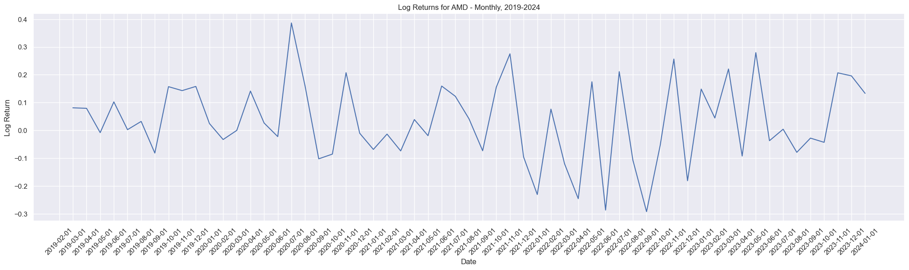

# Pythonic Finance - Financial Engineering/Analysis in Python

Statistical Analysis of Equities using Time Series Models, Regression, the Capital Asset Pricing Model(CAPM), and the Fama French 3-Factor and 5-Factor Models in Python and iPython Notebooks.

I will be taking notes on the Textbook _Statistics and Data Analysis for Financial Engineering with R examples_, and use it as a reference to learn about financial engineering and translate it into Python code and iPython notebooks.

## Jupyter/iPython Notebooks

### _Textbook Notes:_ [Calculating Returns](notebooks/financial_data/returns_textbook_notes.ipynb)

This notebook examines the calculation of Net, Gross and Log Returns of an asset, along with how and why they are used. Included is a comparison of 3 semiconductor equities, ADI, AMAT and AMD, as well as a simple time series for each stock's logarithmic returns over a 5-year period.

### _Textbook Notes:_ [Examining Distributions](notebooks/time_series/notebooks/time_series/exploratory_data_analysis__textbook.ipynb)

### _Python Exercises:_ [Examining Distributions with Histograms and Kernel Density Estimates](notebooks/time_series/exploratory_data_analysis__python_hists_kde.ipynb)

This notebook covers histograms and kernel density estimates for examining sample distributions. Included are histograms and Gaussian KDE's of the semiconductor equity APH, implemented using matplotlib and KDEPy.

### _Python Exercises:_ [Examining Distributions and Testing for Normality](notebooks/time_series/exploratory_data_analysis__python_sample_analysis.ipynb)

This notebook covers testing for normality with samples of asset prices: Sample Quantiles, and Tests of Normality including the Shapiro-Wilk Test are some of the functions in this notebook; The plots covered are Box Plots, Normal Probability Plots, Half-Normal Plots, and Quantile-Quantile Plots.

### _Textbook Notes:_ Time Series Modeling: Basics

### _Textbook Notes:_ Time Series Modeling: Further Topics

### _Textbook Notes:_ [Regression Models](notebooks/regression_models/regression_basics__textbook_notes.ipynb)

This notebook contains notes on Univariate and Multivariate Linear Regression and evaulation of these models, this notebook is a work-in-progress and does not cover all the topics in the chapter yet. This will be completed when the Python Regression Model Scripts are finished.

### _Python Exercises:_ [Simple Linear Regression Model from Scratch](notebooks/regression_models/simple_linear_regression.ipynb)

### _Python Exercises:_ [Multiple Linear Regression Model from Scratch Using Normal Equations](notebooks/regression_models/multiple_linear_regression.ipynb)

### _Textbook Notes:_ Modeling Univariate and Multivariate Statistical Models

### _Textbook Notes:_ GARCH Models

### _Textbook Notes:_ Portfolio Selection

### _Textbook Notes:_ Capital Asset Pricing Model

### Fama-French 3-Factor Model

### Fama-French 5-Factor Model

### Portfolio Evaluation and Comparison Measures

### Custom Regression Models for CAPM and FF3/FF5 Models

## Python Scripts

### Classes

#### Equity.py

Equities are a class that creates a Yahoo Finance Ticker to store Stock Data for Analysis as PKL Files.

#### Portfolio.py

Portfolios are a class that implements a Collection of Equity Objects to run CAPM and Fama-French Portfolio Analysis.

#### OLS_SimpleLinearRegression.py

OLS_SimpleLinearRegression is a superclass for the CAPM and Fama-French Models that contains the multiple linear regression functions and a simple ANOVA table generator.

#### [MultipleLinearRegression.py](https://github.com/dBCooper2/pythonic-finance/blob/main/scripts/classes/multiple_linear_regression.py)

MultipleLinearRegression is a superclass for the Fama-French Models and estimates the betas using the MLR Model's Normal Equations. ANOVA Tables will be added once the subclasses and Simple Linear Regression Classes are done.

#### CAPM_Regression.py

CAPM_Regression is a subclass of OLS_SimpleLinearRegression that overrides the linear regression functions to perform a single-variable linear regression of an asset, and overrides the ANOVA table generator to add CAPM-specific metrics for the stock like Jensen's Alpha.

#### FF_Regression.py

FF_Regression is a subclass of OLS_SimpleLinearRegression that inherits the multiple linear regression functions of its superclass to run either a 3-factor or 5-factor Fama-French analysis on a Stock, and overrides the ANOVA table generator to add finance-specific metrics for the stock.

#### Visualizations.py

Visualizations is a class that handles the visualization of the analysis performed in the regression scripts, and will implement PyGWalker to handle Dashboard creations for a portfolio.

Scripts will be written as/after I finish sections of the textbook, and will focus on Object-Oriented representations of the finance topics covered in the Jupyter/iPython Notebooks

If you are interested in previous projects I have written that cover similar topics, please take a look at:

[CAPM](https://github.com/dBCooper2/financial-modeling/blob/main/notebooks/finance/capm.ipynb) and [Fama-French](https://github.com/dBCooper2/financial-modeling/blob/main/notebooks/finance/fama-french.ipynb) Beta Estimation in Jupyter Notebooks

[Scraping Data from Yahoo Finance](https://github.com/dBCooper2/financial-modeling/blob/main/notebooks/data_processing/yahoo_finance_scraper.ipynb)

Visualizing [Candle](https://github.com/dBCooper2/financial-modeling/blob/main/notebooks/finance/mpl_finance_visualizations.ipynb) and [Financial Statement](https://github.com/dBCooper2/financial-modeling/blob/main/notebooks/finance/visualizing_book_data.ipynb) Data

## Resources

Ruppert, David and David S. Matteson. _Statistics and Data Analysis for Financial Engineering with R examples_. $2^{nd}$ ed., Springer, 2015.

Quantivity. "Why Log Returns?" Quantivity, 21 Feb. 2011, <https://quantivity.wordpress.com/2011/02/21/why-log-returns/>.

Costan, Julian. "Linear vs. Log Returns." Decentralized Meta-Learning, 14 Sept. 2021, <https://blog.costan.ro/post/2021-09-14-linear-log-returns/>.

Mathison, Jake. "Kernel Density Estimation." Kernel Density Estimation, n.d., [mathisonian.github.io/kde/](https://mathisonian.github.io/kde/).

Tommy Odland. [Tommyod/kdepy: Kernel Density Estimation in Python](https://github.com/tommyod/KDEpy/tree/master). v0.9.10, Zenodo, 18 Dec. 2018, doi:10.5281/zenodo.2392268.

Hudson, Robert and Gregoriou, Andros, _Calculating and Comparing Security Returns is Harder than you Think: A Comparison between Logarithmic and Simple Returns_ (February 7, 2010). Available at SSRN: <https://ssrn.com/abstract=1549328>

Meucci, Attilio, _Quant Nugget 2: Linear vs. Compounded Returns – Common Pitfalls in Portfolio Management_ (May 1, 2010). GARP Risk Professional, pp. 49-51, April 2010 , Available at SSRN: <https://ssrn.com/abstract=1586656>
